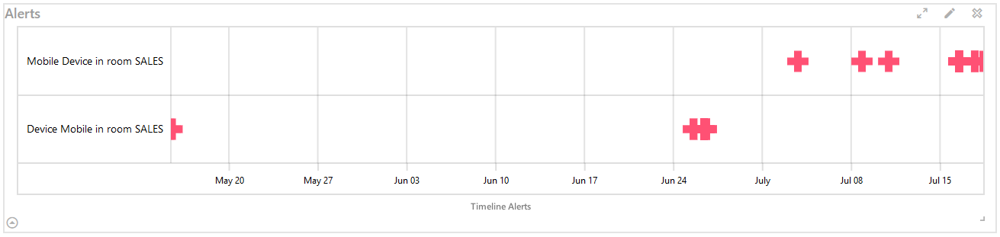
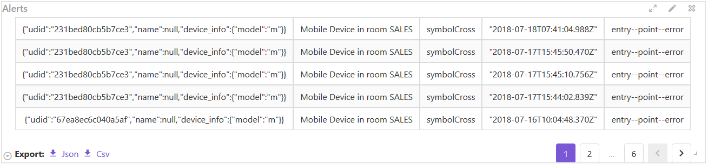
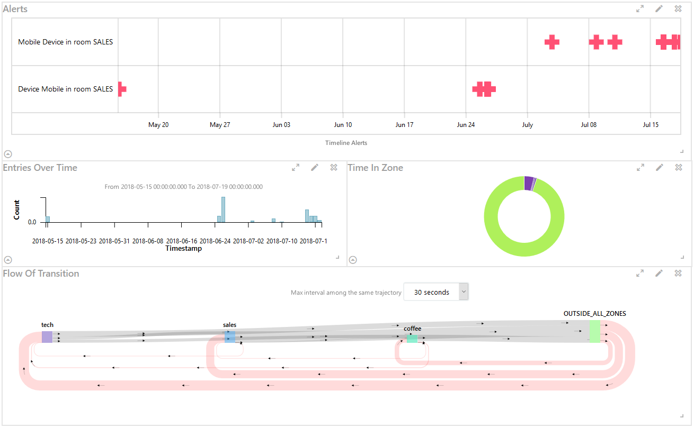

# LayoutGrid

Layout grid system in VueJs, see also:

- [vue-grid-layout](https://github.com/jbaysolutions/vue-grid-layout)
- [Vs](https://github.com/GopherJ/Vs)


## Introduction

This component for creating a dashboard more simply. All config of the dashboard will be saved in the vuex module `LayoutGrid`. In any component of
your SPA, you can add a new item or delete one. I've also added some new features:

- `table mode`
- `json/csv download`
- `UI`

This component use `jbaysolutions/vue-grid-layout` internally and makes it more simple to use, that means the layout is controled in vuex and
every time we need to add a new item. We just to specify the `title`, `is`, `w`, `h` and `data`. It will calculate automatically the next position
and the `i` indentifier.


## Installation

```
npm i -S vue-layout-grid
```

## Usage

`main.js`
```
import Vue from 'vue';
import Vuex from 'vuex';
import LayoutGrid from 'vue-layout-grid';
import Buefy from 'buefy';
import 'buefy/lib/buefy.min.css';

const store = new Vuex.Store();

Vue.use(Vuex);
Vue.use(LayoutGrid, { store });

new Vue({
    store,
    ...
});
```

`index.html`

```html
<link rel="stylesheet" href="//cdn.materialdesignicons.com/2.0.46/css/materialdesignicons.min.css">
```

`template`

```vue
<layout-grid
    :editable="editable"
    :margin="margin"
    :row-height="rowHeight"
    :min-w="minW">
</layout-grid>
```


## Props

|prop|description|type|default|
|:---|:---|:---|:---|
|`editable`|`show border or not`|`boolean`|`true`|
|`margin`|`margin between layout grid item`|`[number, number]`|`[0, 0]`|
|`row-height`|`layout grid item height unit`|`number`|`100`|
|`min-w`|`min w`|`number`|`1`|


## Vuex Module

This component has a vuex module which is registered as `LayoutGrid`.

`store`

```javascript
this.$store.state.LayoutGrid.layout
```

`mutations`

```javascript
// For example, here I need to add a new item to the layout
// This item is the `d3-timeline` component of [Vs](https://github.com/GopherJ/Vs)
// I just need to do:
this.$store.commit('LayoutGrid/ADD_LAYOUT_ITEM', {
    title: 'Alerts',
    is: 'd3-timeline',
    w: 12,
    h: 3,
    data: {
        // props of d3-timeline
        data: [...],
        options: {...},
        width: '100%',
        height: '100%'
    }
});


// EDIT
// This is used to replace/update an item
// For example we change the d3-timeline to d3-timelion
this.$store.commit('LayoutGrid/EDIT_LAYOUT_ITEM', {
    i: '0', // indentifier of d3-timeline, it's generated automatically
    title: 'Entries Over Time',
    is: 'd3-timelion',
    w: 12,
    h: 3,
    data: {
        // props of d3-timelion
        data: [...],
        options: {...},
        width: '100%',
        height: '100%'
    }
});
```


## Special Thanks

[jbaysolutions](https://github.com/jbaysolutions)


## Screen Shots

*###UI*




*###Dashboard*

